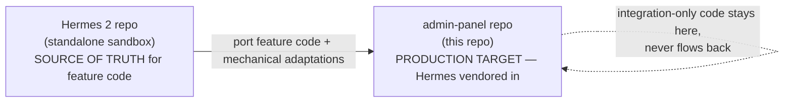

# Hermes — Handover (start here)

You're taking over **Hermes**, the internal access-management module that lives vendored
inside this admin-panel. This folder is a **flow-and-logic handover** for a developer who
knows the stack (Node/Express/Prisma/React) but is new to this system. It deliberately
describes *how the system behaves* — the request lifecycle, per-platform provisioning,
what runs on a schedule, what fails and how it recovers — rather than mapping files. When
you need to touch code, the flows here tell you *what* happens and *why*; the code tells
you *where*.

---

## The one-paragraph mental model

Hermes replaces "ping someone on Slack to get access" with a self-service workflow. A user
requests access to a **group** (a named bundle of permissions on some external platform —
Redash, AWS, ZooKeeper, Secrets Manager). An admin reviews it. On approval, Hermes
**provisions the real access on that platform automatically**. Access can be time-boxed
(auto-expires) or permanent, and every state change is written to an audit log. Hermes'
own Postgres database is the **single source of truth** for who has what; the external
platforms are treated as *provisioning targets* that Hermes pushes to and periodically
reconciles against — never as the source of truth.

## The one fact that trips everyone up

**Hermes lives in two repos, and this is not one of them for authoring features.**

Feature code (controllers, services, pages, components) is **built and tested in the
Hermes 2 repo first**, then copied into `backend/src/hermes` + `frontend/src/hermes` here
with a few mechanical adaptations. A handful of files exist **only here** (the mount glue,
the Redis leader lock, the multi-DB Prisma wiring) and must never be overwritten by a port.
If you edit feature logic directly in this repo without backporting it, the two copies
drift and the next sync silently reverts you. See
[04-admin-panel-integration.md](04-admin-panel-integration.md) for the full model.

---

## Reading order

1. **[01-core-access-flow.md](01-core-access-flow.md)** — the request lifecycle every
   platform shares. This is the backbone; read it first, everything else references it.
2. **[02-platform-flows.md](02-platform-flows.md)** — how each platform (Redash, AWS
   Identity Center, ZooKeeper, Secrets Manager) hangs off that backbone, and how to add a
   fifth one.
3. **[03-auth-and-roles-flow.md](03-auth-and-roles-flow.md)** — who can approve what, and
   how a request routes to the right approver.
4. **[04-admin-panel-integration.md](04-admin-panel-integration.md)** — what changes
   because this runs vendored, multi-replica, in prod.
5. **[05-operations-and-deploy.md](05-operations-and-deploy.md)** — external dependencies,
   scheduled jobs, failure/recovery, and how a change reaches prod.
6. **[06-known-issues-roadmap.md](06-known-issues-roadmap.md)** — open work, current
   drift, gotchas.

## Deeper reference (the Hermes 2 docs)

The Hermes 2 repo carries a full 11-file `docs/` set (architecture, per-domain deep-dives,
data model, runbook). **This handover intentionally does not duplicate it** — when you want
the exhaustive detail behind a flow, read `docs/` in the Hermes 2 repo. This set is the
*admin-panel* handover: flow understanding plus the integration/ops knowledge that isn't
written down anywhere else.

---
