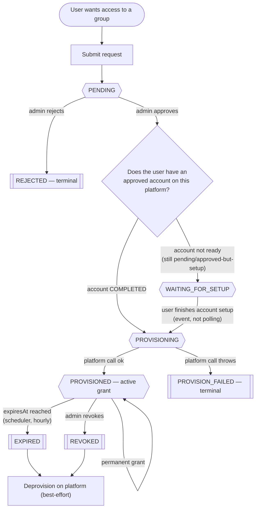
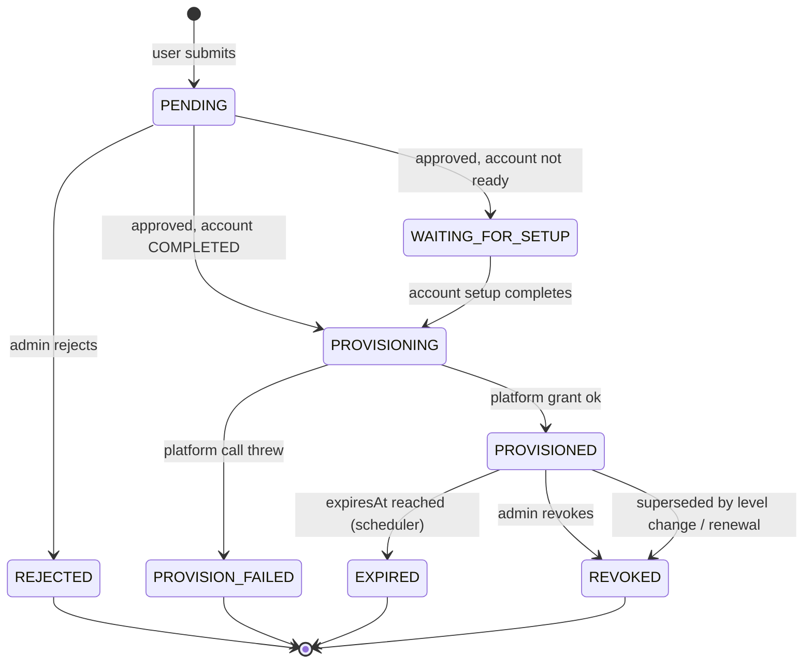
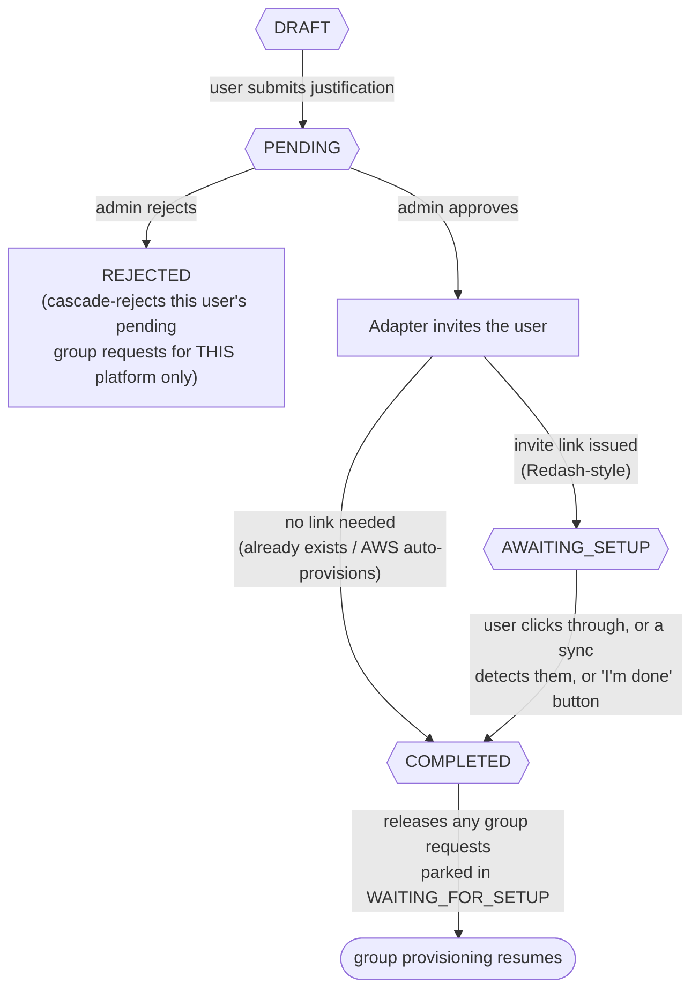
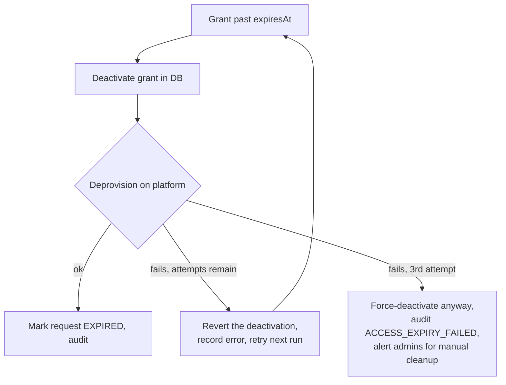

# The core access flow

This is the backbone of Hermes. Every platform plugs into *this* loop — Redash, AWS,
ZooKeeper and Secrets Manager only differ in the "provision" step at the bottom. Understand
this one flow and the rest of the system is variations on it.

The single most important idea: **Hermes commits its own database state first, then pushes
to the external platform best-effort.** If the platform call fails after Hermes has already
recorded the change, Hermes does *not* roll back — it logs/audits the failure for manual
cleanup. The reasoning: Hermes' grant record is the thing being protected, and "DB says
revoked but platform still has them" is a safer failure than the reverse.

---

## The lifecycle, end to end

### Stage by stage

**Request created.** A user asks for a group. Hermes validates the group exists, that the
requested level is active and fully configured, that the user doesn't already hold active
access, and that they don't already have an open request for it. It persists a `PENDING`
row, writes a `REQUEST_CREATED` audit entry, and emits a `request.created` event (which
notifies the group's admins). There is **no self-service cancel** — a user who changes
their mind waits for an admin to reject.

**Admin review.** The admin either rejects (terminal) or approves. Approval doesn't jump
straight to provisioning — first it checks the **account gate** (below).

**The account gate.** Before anyone can hold a group on platform X, they need an
*account* on platform X, and that account creation is itself admin-approved (see
[account creation](#the-account-gate-user-creation) below). So on approval:
- account not yet ready → the request parks in `WAITING_FOR_SETUP` (not a dead end).
- account `COMPLETED` → the request moves to `PROVISIONING` and Hermes calls the platform.

**Provisioning.** Hermes asks the platform adapter to grant the access, then records an
active grant (one row representing "user U holds group G, active, optionally expiring at
T"). Success → `PROVISIONED`. If the platform call throws → `PROVISION_FAILED`, which is
**terminal** — there's no retry button; an admin creates a fresh request or grants directly.

**Active grant → end of life.** A permanent grant just stays active. A time-boxed grant is
swept up by the scheduler when its expiry passes. An admin can revoke at any time. Both
expiry and revoke deprovision on the platform *after* the Hermes-side deactivation commits.

---

## The states a request moves through

---

## The account gate (user creation)

This is a **separate, per-platform pre-requirement** that sits in front of group access.
A user can be approved on Redash but still pending on AWS — the gates are independent.

Key points:
- A `DRAFT` row is created lazily the first time a user loads the app for a platform they
  aren't known on. If the platform already knows them, it auto-completes silently.
- Approval immediately triggers the invite. `APPROVED` is meant to be *transient*; a row
  stuck on it means the invite call failed and is waiting on a resend.
- Reaching `COMPLETED` fires an event that **releases every group request that was parked
  in `WAITING_FOR_SETUP`** for that user+platform — this is the join between the two flows.
- **Rejection cascades per-platform only** — rejecting someone's Redash account
  auto-rejects their pending Redash group requests, but never touches their AWS requests.

---

## Level changes & renewals: the atomic swap

A user changing level, or renewing before expiry, never results in two active grants
coexisting. Hermes does an **atomic swap** in one DB transaction: deactivate the old grant,
create the new one, mark the old request superseded, mark the new one provisioned. *Only
after that transaction commits* does it deprovision the old access on the platform
(best-effort). Renewals go through the same admin-approval flow as any request — there is
**no self-service renewal**.

There is a subtlety for multi-target platforms (ZooKeeper): when deprovisioning the old
grant, Hermes tells the adapter which paths the user still legitimately holds *via other
groups*, so a level swap on one group doesn't strip access granted by another. Single-target
platforms (Redash, AWS) ignore this.

---

## Expiry: the safety-valve retry

Expiry runs on a schedule (hourly in prod). For each grant past its `expiresAt`:

The important operational takeaway: after 3 failed attempts Hermes **gives up on the
platform side but still removes the Hermes-side grant**, and alerts admins — meaning the
user may retain platform-side access that needs manual cleanup. These show up in the audit
log as `ACCESS_EXPIRY_FAILED`.

---

## The machinery that drives all of this

Three background mechanisms make the flow work. They matter here because in prod (vendored,
multi-replica) some of them are **leader-gated** — see
[04-admin-panel-integration.md](04-admin-panel-integration.md).

**Event bus.** State-changing operations emit fire-and-forget events (`request.created`,
`request.approved`, `access.revoked`, `user-creation.completed`, …). A single listener
layer fans these out to notifications (in-app + email + Slack) and, in one case, to default
group membership. This exists purely to **decouple approval from side effects** — a Slack
outage must never block or roll back an approval. Delivery is at-most-once with no retry;
the audit log (written *before* the event fires) is the authoritative record.

**Scheduler.** In-process cron jobs: auto-revoke expired grants, refresh the platform
user/group cache, reconcile Keycloak admin roles into the DB mirrors, sweep requests stuck
mid-apply, and prune old notifications. Every job swallows its own errors so one bad run
never kills the scheduler.

**Notifications.** Two layers: a persistent layer that writes an in-app notification row
and also fires email + Slack concurrently (each channel fails silently), and a real-time
layer that pushes new notifications down open Server-Sent-Events connections. The in-app
row is always the ground truth for "did this fire"; email/Slack are best-effort on top.

---

## Invariants that will bite you if you forget them

- **One active grant per (user, group)** — enforced by a partial unique DB index, not just
  app logic. A concurrent double-approve is caught and treated as "already granted."
- **Expiry is computed at provision time, not request time.** A 1-day request that sat
  pending for 3 days expires 1 day *after approval*.
- **`PROVISION_FAILED` and `REJECTED` are terminal.** No retry button; make a new request.
- **A level with no configured external target blocks the request at *creation* time**, on
  purpose, so it can never silently fall back to broader permissions.
- **Admin-ship and membership are independent.** Being a group admin doesn't grant you the
  group; removing an admin doesn't revoke their membership.
- **Provisioning failures never roll back a committed Hermes-side change** — they surface
  as an error field on the record and an audit entry, waiting for a retry or manual fix.
