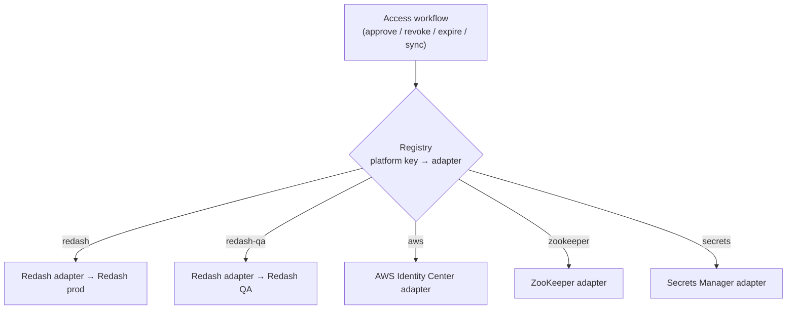
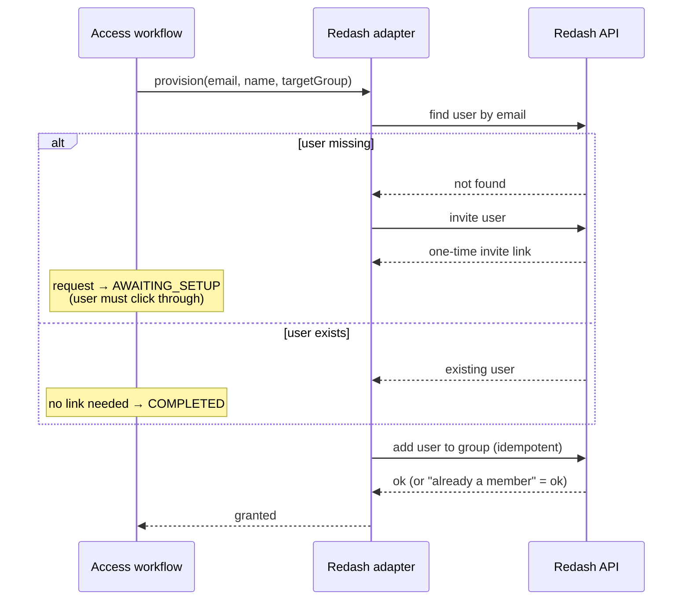
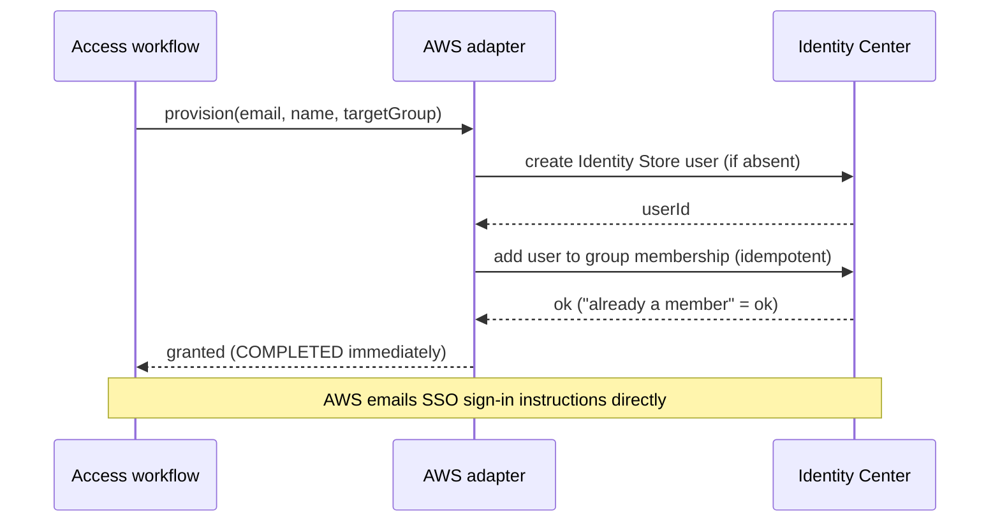
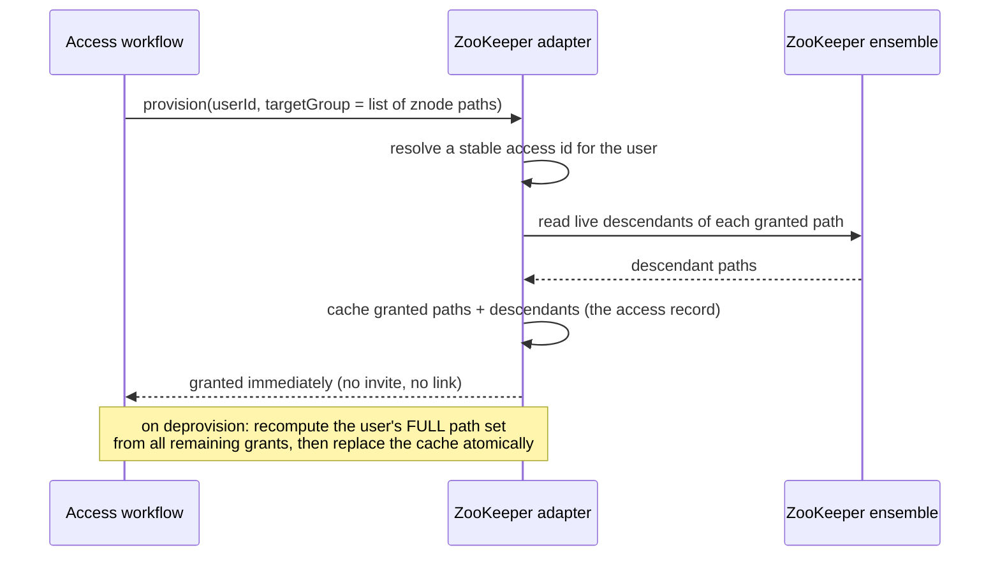
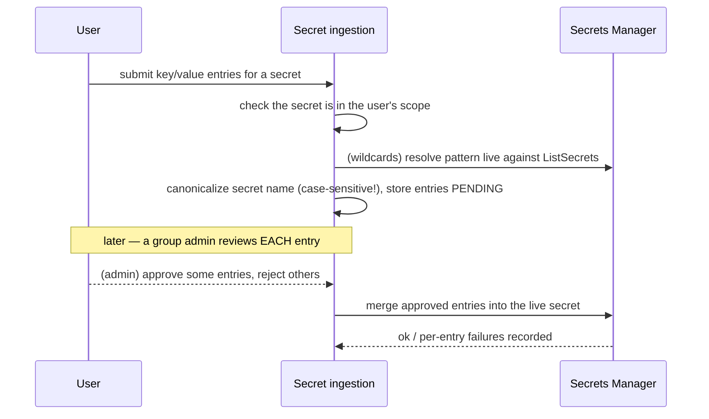
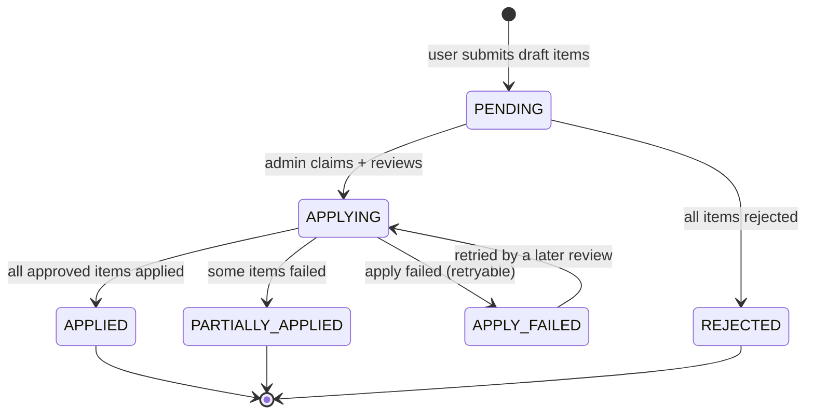

# Platform flows

Every platform plugs into the [core access flow](01-core-access-flow.md) through one
shared contract — a **platform adapter**. Workflow code never talks to a platform's API
directly; it only ever calls the adapter. That's what makes adding a fifth platform "write
one adapter," not "touch the request lifecycle."

## How platforms plug in (the adapter + registry)

The **registry** is a map from a platform key to a single adapter instance, built once at
startup. Each configured Redash instance (prod, and optionally QA) gets its *own* adapter
registered under its own key — that's how multi-instance works. Unconfigured platforms are
simply skipped, so a missing QA URL means "no QA," not a crash.

Every adapter implements the same contract. The parts worth knowing conceptually:
- **Lifecycle**: provision, deprovision, check-status, invite (and, for platforms with a
  regenerable one-time link, re-invite).
- **Sync**: pull the platform's users/groups into Hermes' read-through cache, plus a
  single-user fast path for the "I finished setup" button.
- **Group lifecycle**: create/delete the backing group on the platform.
- **Offboarding**: disable a user — and a flag saying whether that's *reversible* (Redash)
  or *permanent* (AWS). This distinction matters a lot operationally.
- **Presentation**: the launch URL and the "you're in, here's how to log in" copy.

Two request shapes flow through it: a **provision context** (email, name, userId, the
target group's external id) and a **deprovision context** (which carries "paths the user
still holds via other groups" for multi-target platforms).

**Adding a platform** = write a raw API client + an adapter that implements the contract,
then register it. Nothing in the request lifecycle changes.

Below, each platform's provisioning round-trip and its quirks.

---

## Redash (prod + QA)

BI/dashboard tool. Groups map to Redash groups. This is the most mature integration and the
only multi-instance one.

Quirks that matter:
- **Reversible disable.** Offboarding sets `is_disabled=true` — it can be undone. Resync
  deliberately leaves disabled accounts alone.
- **Per-user serialization.** Redash group membership is a read-modify-write on an array,
  so all membership changes for one user are serialized in-process to stop concurrent
  add/remove from clobbering each other. (This is in-process only — see the multi-replica
  note in [04](04-admin-panel-integration.md).)
- **Invite-link staleness.** Stored links are re-normalized against the *current* base URL
  on every read, and can be regenerated, because the base URL can drift after issue.
- **Two maintenance flows** sit on top: an **import** (one-way backfill of pre-existing
  Redash users into Hermes) and a **resync** (bidirectional correction after someone edits
  Redash directly). Resync caps destructive removals per run as a safety valve — see the
  runbook in [05](05-operations-and-deploy.md).

---

## AWS IAM Identity Center

SSO. Provisions an Identity Store user + group membership. **Immediate — no invite link;
AWS itself emails the sign-in instructions.**

Quirks:
- **Permanent, irreversible offboarding.** Disabling a user *deletes* them. This is the
  opposite of Redash — be careful with force-offboarding flows.
- **Eventual consistency.** A freshly created user/group can briefly 404 on a follow-up
  read; the adapter retries with backoff, and cache pruning skips just-invited users so
  they aren't erased before AWS lists them.
- **Toggle.** AWS is the one platform that can be turned off entirely via config, which is
  useful when the account is unavailable.
- One reserved group holds the service account's own admin permissions and is hidden from
  being requestable.

---

## ZooKeeper

Write access to a znode tree. **This one is structurally different — read this before you
touch anything ZK-related.**

The load-bearing invariant: **managed znodes are world-open and no per-user credentials are
ever minted.** Access is enforced entirely at the Hermes application layer — the Postgres
record of who holds which paths *is* the access-control record, checked on every read/write
Hermes proxies. This works because the ZK ensemble is network-isolated and Hermes is the
only gateway to it. There is deliberately no per-znode ACL rewriting on grant/revoke.

Quirks:
- A ZK group's "external id" is a **newline-separated list of znode paths**, each
  optionally suffixed with a permissions spec.
- **Multi-target.** A user can reach the same subtree through several groups, which is why
  deprovision recomputes their *entire* effective path set rather than just subtracting one
  group — this is the case the "retain paths held via other groups" mechanism protects.
- **Blank-email users.** Live JWTs can lack an email; two such users would collide on an
  empty-email key, so the cache keys them on their userId instead.
- **A separate config-change workflow** rides on top of provisioning: users submit draft
  znode edits (set/create/delete/clear) scoped to paths their grants cover, a group admin
  reviews each change, and apply is synchronous on approval. See
  [the change-request pattern](#the-approval-then-apply-pattern) below.

---

## AWS Secrets Manager

Approval-gated ingestion of key/value pairs into secrets. Same "no user directory, the
cache is the access record" shape as ZooKeeper. **Newest and least mature of the four.**

The problem it solves: AWS Secrets Manager has no per-user access model — a secret is only
protected by IAM role, and Hermes' service credential can read/write all of them. Secret
ingestion is Hermes' approval-gated bridge on top.

Quirks:
- A secrets group's "external id" is a list of secret names **or wildcard patterns**.
  Wildcards are resolved *live* every time (never cached), so a newly created matching
  secret shows up immediately.
- **Secret names are case-sensitive on AWS** — Hermes canonicalizes to the live casing so a
  wrong-case submit matches the intended secret instead of silently creating a sibling.
- **Deleting a Hermes secrets-group never deletes the real AWS secret** — deliberate no-op.
- Least mature: no multi-instance, no background sync (there's no directory to sync).

---

## The "approval, then apply" pattern

ZooKeeper config changes and secret ingestion are the **same shape** — if you understand
one you understand the other: a user drafts changes scoped to what their grants cover, an
admin reviews **each item individually**, and approved items are applied **synchronously on
approval**. There's no resting "approved but not applied" state.

A scheduled sweep rescues anything stranded in `APPLYING` by a crash between "claimed" and
"terminal status written," flipping it to `APPLY_FAILED` so it's retryable. Note these are
**two separate implementations** that happen to share a shape — if you fix a bug in one,
check whether the other needs the same fix.
