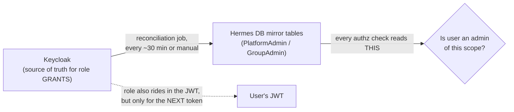
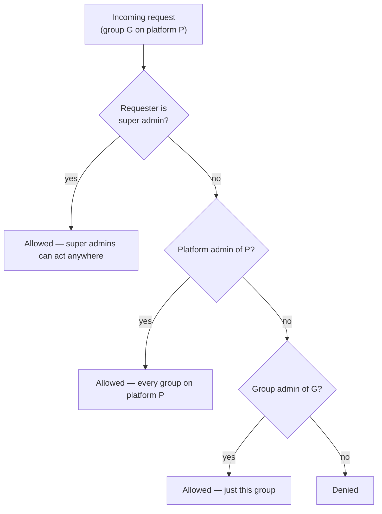

# Auth & role-routing flow

Two separate questions, don't conflate them:

- **Authentication** — is this a valid token, and who is the user? Answered by verifying a
  Keycloak-issued JWT (or, in non-prod simulation mode, accepting one of four magic tokens
  standing in for each tier).
- **Authorization** — what may this user do? Answered by the three-tier model below,
  **checked against Hermes' own database, not against the JWT's roles directly.**

That second point is the one non-obvious design decision, so it leads.

---

## Why authorization reads a DB mirror, not the JWT

Keycloak is the system of record for *role grants* — an admin assigns an admin role there.
But every authorization check in Hermes reads **mirror tables in Hermes' own Postgres**
(`PlatformAdmin`, `GroupAdmin`), not the JWT's role claims, for the platform/group tiers.

Three reasons it's built this way:
1. **Instant revocation.** Deleting a mirror row revokes authorization immediately.
   Removing the Keycloak role only affects the *next* token the user is issued — JWTs are
   self-validating and don't expire early.
2. **Works offline / in simulation.** No live Keycloak round-trip on every check.
3. **Fast.** A local DB read beats an admin-API call.

A reconciliation job keeps the mirror in sync **one-directionally: Keycloak → DB, never the
reverse.** If Keycloak is unreachable, reconciliation is *skipped entirely* rather than
wiping the mirror on missing data.

**Operational consequence** (you'll hit this): a role change has *two* lag sources — the
mirror catching up to Keycloak (fixed by forcing reconciliation), and the user's already-
issued JWT still carrying old roles until they re-login. The runbook in
[05](05-operations-and-deploy.md) covers both.

---

## The three tiers, as an approval-routing flow

The whole point of the tiers is *who a given request goes to*. Every request is scoped to a
group on a platform, and it routes to whoever administers that scope.

| Tier | Scope | What it can do |
|---|---|---|
| **Super admin** | everything, every platform | approve/reject anywhere; group & admin CRUD anywhere; view audit log; trigger sync / reconciliation / import / migration tooling |
| **Platform admin** | every group on one platform | everything a group admin can, across that platform; group & level CRUD; assign group admins; approve account-creation — but **cannot** trigger global sync/reconciliation or touch other platforms |
| **Group admin** | one group | approve/reject that group's access requests; add/remove members; set member levels directly (admin override) — **cannot** create groups or manage other admins |

Every authenticated user also implicitly gets the base **user** tier (request access, see
their own history). Admin tiers are **additive and independent of membership** — being an
admin of a group does not grant you access to it; you request it like anyone else.

---

## What the frontend gets

On login the backend returns the user's computed admin scope — a compact
`{ superAdmin, platforms[], groups[] }` — which the SPA uses to gate navigation and routes.
That's a UI convenience only; the backend re-checks authorization on every mutating
endpoint regardless of what the frontend showed. Never treat frontend gating as the
security boundary.

---

## Keycloak specifics worth knowing

- A role change reaches a user's JWT only on their **next login or token refresh**. Forcing
  a logout is the only lever to make it sooner, and it still doesn't invalidate an
  already-issued token.
- Scoped admin roles are set up as composites of a marker role, so a scoped role
  automatically carries its marker into the JWT.
- In simulation mode (non-prod) all Keycloak-mutating calls become logged no-ops, but the
  DB mirrors are still maintained by the calling code — so authorization behaves identically
  to live mode without a live Keycloak.

> TODO(rishit): the exact Keycloak realm, client id, and where the `hermes_*` roles are
> administered — capture the current values so the next maintainer can find them.
