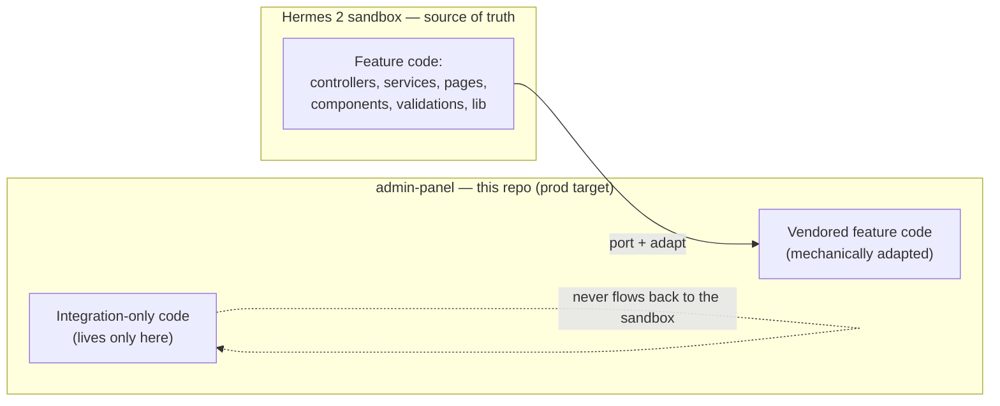
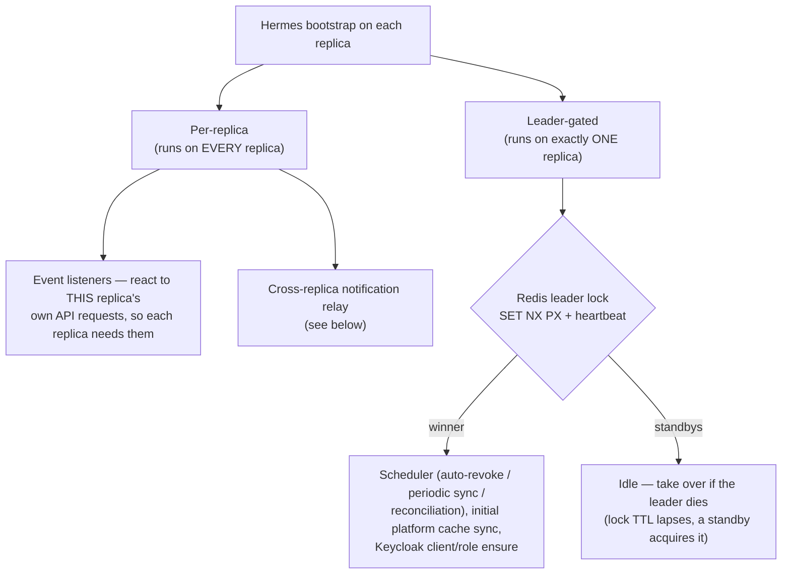
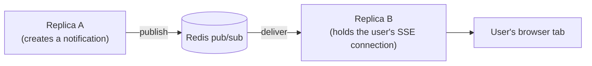

# Running vendored, multi-replica, in prod

Everything in docs 01–03 describes how Hermes behaves *as a system*. This doc is about the
three things that change because it runs **here** — vendored into admin-panel, as a
sub-app, across several replicas in production — rather than as the standalone sandbox.

---

## 1. The two-repo vendoring model

Hermes is developed in a **standalone repo** (the "Hermes 2" sandbox: single process,
single DB, no multi-replica concerns) and **vendored into admin-panel** as the production
deployment target. Feature code is authored and tested in the sandbox, then ported here.

**Two classes of code live here:**

- **Vendored feature code** — should stay *logically identical* to the sandbox, modulo a
  few mechanical adaptations. Don't hand-author feature logic here; author it in the
  sandbox and port it, or the copies drift and the next sync reverts you.
- **Integration-only code** — exists **only** in admin-panel and is never ported back: the
  mount glue (Hermes runs as a mounted sub-app here, not a standalone `app.listen()`
  process), the **Redis leader lock** (below), the cross-replica notification relay
  (below), and the adapted config that reads admin-panel's environment.

**The mechanical adaptations** applied when porting sandbox → here:
- **Prisma imports.** The sandbox is single-DB; admin-panel is multi-DB with several
  generated Prisma clients, so Hermes here imports its client from admin-panel's generated
  location instead of the default package. Nearly every service/controller that touches the
  DB differs on exactly this one line.
- **Formatting + line endings.** admin-panel's lint/format and CRLF line endings reformat
  ported files, so a raw diff between the two repos reports nearly every line as "changed"
  even when the logic is identical. Compare *normalized* versions to see real drift.

Full sync discipline (what to include in a PR, what to never commit, how to normalize-diff)
lives in the workspace-root and admin-panel `CLAUDE.md` files — read them before porting.
The short rules: keep PRs scoped to what the feature actually needs; never commit one-shot
CLI scripts or test files; never overwrite the integration-only files.

---

## 2. Multi-replica: what runs once vs. everywhere

The standalone sandbox runs a **single process**, so its scheduler and startup work just
run. admin-panel runs **several replicas in prod**, and some of Hermes' work mutates
**shared state** — external platforms (Redash/AWS), the shared platform cache in Postgres,
and the prod Keycloak realm. If every replica ran that work, you'd get duplicate deprovision
calls against the same grants, external-platform rate-limit pressure, and N redundant writes
to the prod IdP.

So at bootstrap, work is split into two buckets:

How the lock behaves:
- One replica holds a single Redis key (`SET NX PX`), renewed on a heartbeat at ~⅓ of the
  TTL. If the leader dies, the key's TTL lapses and a standby acquires it within the TTL
  window. Compare-and-set (Lua) on renew/release means a replica can only renew or release a
  lock it still owns — avoiding the classic "expired-then-reacquired-by-another" race.
- **Fail-safe posture:** if Redis is unreachable, *no* replica becomes leader, so the
  shared-state work runs *nowhere* — safe (never duplicated), self-healing (every tick
  retries), and logged loudly so paused auto-revoke is visible.
- **One-time setup guard:** the Keycloak ensure + initial sync run once even across
  leadership flaps; only the scheduler is restarted on failover.
- **Enable/disable:** leader election turns on when it detects a real multi-replica
  deployment (prod, or simply the presence of a Redis host), and is skipped in
  single-instance dev. There's an explicit override flag, plus a hard per-replica kill
  switch that disables the scheduler entirely on a given replica.

The mental model to carry: **event listeners run everywhere** (they respond to the API
traffic each replica itself serves), **the scheduler and one-time setup run on the leader
only**.

---

## 3. Real-time notifications across replicas

The real-time (Server-Sent-Events) notification layer holds open connections **in-process**.
With multiple replicas, a notification created while handling a request on replica A must
still reach a user whose browser tab is connected to replica B. A **Redis pub/sub relay**
(admin-panel-only) bridges this: every replica publishes new notifications and subscribes to
the others', so delivery reaches whichever replica holds the connection.

It runs on **every** replica (each must both publish and subscribe), no-ops without a Redis
host (delivery gracefully degrades to per-replica, exactly the sandbox behavior), and is
fire-and-forget so a Redis hiccup never blocks boot.

---

## 4. Mount & URL prefix

The standalone sandbox serves Hermes at the root; admin-panel mounts it as a **sub-app under
a `/hermes` prefix** on both backend and frontend. This is the single most common source of
a broken port: a naive copy of a frontend file that hard-codes an unprefixed route or link
silently strips the prefix and breaks navigation. When porting any file that does routing,
navigation, or builds API URLs, diff it against the committed admin-panel version afterward
— the prefix handling is an admin-panel adaptation, not something to overwrite from the
sandbox.

---

## Bootstrap order (why it matters)

Two ordering constraints are load-bearing:
1. Secrets are loaded from the secret store into the environment **before** any Hermes
   service module is imported, so their config reads see the injected values, not
   import-time defaults. (This is why the bootstrap uses dynamic imports.)
2. Event listeners are registered **before** anything can emit on the bus, so no early
   event is dropped.

The bootstrap is idempotent and never rejects — admin-panel fires it and forgets, so a
Hermes init problem degrades Hermes without crashing the whole admin-panel process.
