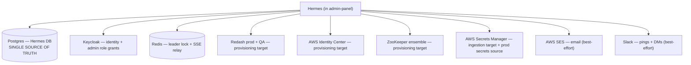
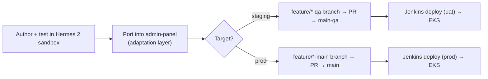

# Operations & deploy

What Hermes depends on in prod, what runs on a schedule, how things fail and recover, and
how a change gets from your editor to production.

---

## External dependencies (and what each failure looks like)

| Dependency | Hermes' posture if it's down |
|---|---|
| **Postgres (Hermes DB)** | Hard dependency — it's the source of truth. No graceful degradation. |
| **Keycloak** | Authentication fails for new logins. Authorization still works (reads the DB mirror). Reconciliation is *skipped* (never wipes the mirror on missing data). |
| **Redis** | No replica becomes leader → scheduler/sync pause **everywhere** (safe, self-healing). SSE degrades to per-replica. Neither blocks API traffic. |
| **Redash / AWS / ZooKeeper** | Provisioning/deprovisioning for that platform fails and surfaces as an error field + audit entry; the Hermes-side state change still commits (best-effort model). Other platforms unaffected. |
| **SES / Slack** | Fail **silently by design** — the in-app notification still persists. An approval never blocks on a notification channel. |

---

## Scheduled jobs (leader-only in prod)

These run on the elected leader replica only (see
[04-admin-panel-integration.md](04-admin-panel-integration.md)). Cadences are the prod
values.

| Job | Cadence | What it does |
|---|---|---|
| Auto-revocation | hourly | Revoke + deprovision grants past their expiry (with the safety-valve retry from [01](01-core-access-flow.md#expiry-the-safety-valve-retry)) |
| Platform sync | every 15 min | Refresh the platform user/group cache and reconcile Hermes' group records against reality |
| Admin reconciliation | every 30 min | Pull Keycloak admin roles into the DB mirror tables |
| Stuck-apply sweep | every 10 min | Flip ZooKeeper/secret change-requests stranded in `APPLYING` to a retryable failed state |
| Notification prune | daily | Delete read notifications older than 30 days, and *any* notification older than 90 days |

Every job swallows its own errors so one bad run never kills the scheduler.

---

## Runbook — "something's in a weird state"

**General first moves, in order:**
1. **Check the audit log** for the relevant group / request / user — every state
   transition writes one, newest first.
2. **Check the error field on the record itself** (provision error, last-expiry error,
   apply error, invite error) *before* assuming the code is broken — most "stuck" states
   are a surfaced platform error waiting on a retry or manual fix.
3. **Check which simulation flags are on** — a surprising share of "why didn't X happen"
   is "that integration is simulated right now."

**A request is stuck on `PROVISION_FAILED`.** Terminal by design. Read its provision error
(usually a misconfigured external target on the group/level, or a brief platform outage),
fix the root cause, then have an admin create a fresh request or grant directly.

**A grant won't auto-expire / keeps showing an expiry error.** The scheduler retries hourly
up to 3 times, then force-deactivates the Hermes-side grant and audits an expiry failure —
meaning the **platform-side access may still exist and needs manual cleanup**. Find these by
searching the audit log for the expiry-failed action.

**A ZooKeeper or secret change-request is stuck on `APPLYING`.** Normally self-heals within
one sweep cycle (10 min). If it's stuck longer, the scheduler itself may not be running —
in prod that usually means **no leader** (check Redis health and the leader-election logs).

**Admin role change isn't taking effect.** Two independent lag sources: the mirror catching
up to Keycloak (force reconciliation to fix immediately), and the user's already-issued JWT
still carrying old roles until they re-login. Remember authz reads the *mirror*, not
Keycloak — if the mirror is right but behavior is wrong, the bug is elsewhere.

**A platform group was renamed/deleted/recreated outside Hermes.** Platform sync heals this
automatically within one cycle (15 min) — it re-links recreated groups before archiving
vanished ones, honors a short grace period for just-appeared groups, and **aborts entirely
on an empty sync result** (a safety valve against wiping everything on a transient platform
outage). Give it one cycle and check for a fresh audit entry from the sync system before
investigating.

**Redash membership looks out of sync.** Two tools: **import** (one-way backfill of
pre-existing Redash users) and **resync** (bidirectional correction after a direct edit).
Resync caps destructive removals per run — exceeding the cap needs an explicit force flag —
and **deliberately leaves disabled Redash accounts alone** (that's the reversible-offboarding
model, not a bug). Read the returned report before assuming something broke.

**Notifications aren't arriving (email/Slack).** Both channels fail silently by design, so
"request went through but no Slack ping" is almost always a channel misconfiguration or an
accidentally-on simulation flag — not a backend bug. The in-app notification is ground truth
for "did it fire at all."

> TODO(rishit): where prod logs are (CloudWatch group / Kibana / etc.) and how to query
> them. The runbook above assumes you can reach the audit log and process logs.

---

## How a change reaches prod

- `main` is **production**; `main-qa` is **QA/staging**.
- Feature work branches **per target** — a branch destined for `main` and/or one for
  `main-qa`. Check existing branch names for the naming convention before creating one.
- Deploys go through Jenkins with a manual environment parameter (prod or uat) to EKS;
  images are pushed to ECR. This is a **manual, parameterized deploy**, not auto-on-merge.
- Reminder from the vendoring rules: never commit one-shot CLI scripts or test files, and
  keep each admin-panel PR scoped to just what the feature needs.

> TODO(rishit): who can trigger a Jenkins deploy, the job name/URL, and the approval step
> (if any) before a prod deploy.
> TODO(rishit): the prod + QA Redash URLs, the Keycloak realm URL, and the admin-panel
> URL where Hermes is served (under the `/hermes` prefix).
