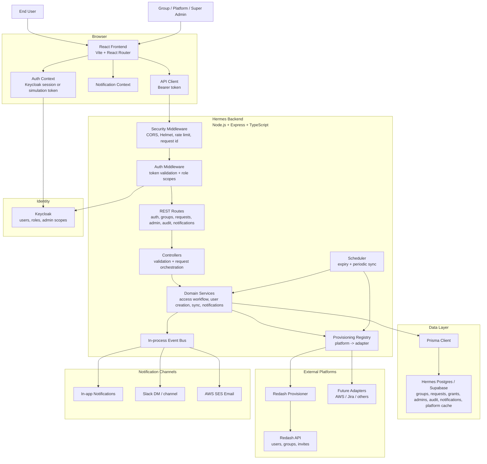
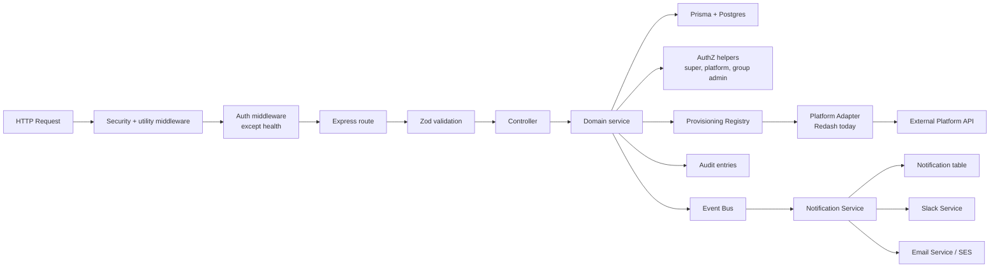
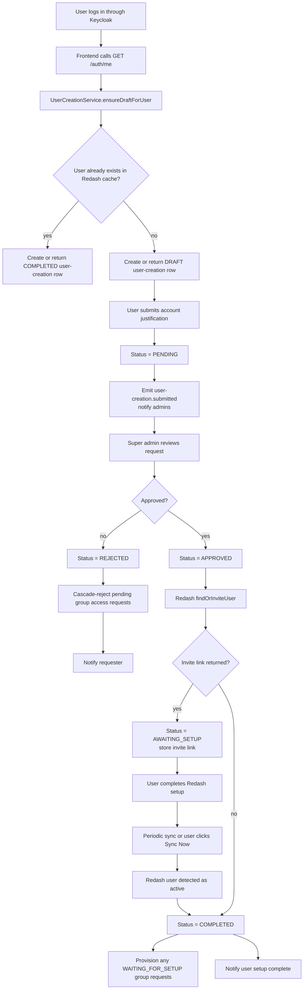
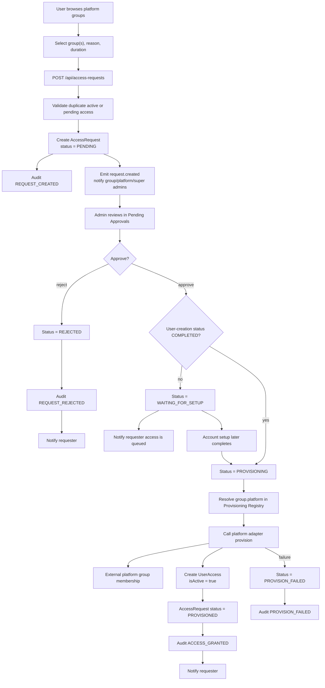

# Hermes HLD Flowchart

Hermes is an access governance application for requesting, approving, provisioning, auditing, and expiring access to external platforms. Redash is the active platform adapter today; the backend is already shaped so AWS, Jira, or other platforms can be added through the provisioning registry.

## 1. System Context

## 2. Backend Module Flow

## 3. Account Creation Flow

## 4. Group Access Request Flow

## 5. Revocation, Expiry, and Sync Flow

```mermaid
flowchart TD
    subgraph Manual["Manual Revocation"]
        AdminRevoke["Admin revokes active UserAccess"] --> Deprovision["Adapter deprovisions external membership"]
        Deprovision --> DisableGrant["Set UserAccess.isActive = false"]
        DisableGrant --> MarkRevoked["Set AccessRequest = REVOKED"]
        MarkRevoked --> AuditRevoked["Audit ACCESS_REVOKED"]
        AuditRevoked --> NotifyRevoked["Notify user"]
    end

    subgraph Scheduled["Scheduled Expiry"]
        Scheduler["Scheduler scans expired active grants"] --> Expire["AccessWorkflowService.expireAccess"]
        Expire --> ExpireDeprovision["Adapter deprovisions external membership"]
        ExpireDeprovision --> DisableExpired["Set UserAccess.isActive = false"]
        DisableExpired --> MarkExpired["Set AccessRequest = EXPIRED"]
        MarkExpired --> AuditExpired["Audit ACCESS_EXPIRED"]
        AuditExpired --> NotifyExpired["Notify user"]
    end

    subgraph CacheSync["Platform Cache Sync"]
        Sync["Initial / scheduled / admin-triggered sync"] --> Registry["Provisioning Registry"]
        Registry --> SyncAdapters["Registered adapters sync users and groups"]
        SyncAdapters --> Cache["Upsert platform_external_users and platform_external_groups"]
        Cache --> UserCreationDetect["Detect completed Redash setup"]
        UserCreationDetect --> WaitingProvision["Provision queued access requests"]
    end
```

## 6. Main Responsibilities

| Layer | Responsibility |
| --- | --- |
| React frontend | Authenticated user experience, role-aware navigation, request forms, approval screens, admin management, audit log, notifications |
| Auth context | Keycloak login/token refresh in live mode, simulation roles in dev mode |
| Express API | REST boundary, security middleware, validation, controller orchestration |
| Domain services | Access workflow, user creation lifecycle, notifications, platform sync, scheduler logic |
| Prisma/Postgres | Source of truth for Hermes groups, admins, access requests, active grants, notifications, audit, platform cache |
| Keycloak | Source of truth for identity and admin role assignments |
| Provisioning registry | Platform routing by `Group.platform`, allowing Redash today and future adapters later |
| Redash provisioner | External user invite, group membership provisioning, deprovisioning, user/group sync |
| Event bus | In-process fanout for notification side effects |
| Notification services | In-app notification rows, Slack messages, and SES emails |

## 7. Current Scale Notes

- The event bus is in-process, so notification side effects are not durable across backend crashes.
- Bulk request/review endpoints are planned but not implemented yet; current UI paths can make multiple HTTP calls.
- Platform cache storage is already generic, so adding a new platform should mainly require a new adapter and registry registration.
- The Redash account creation gate is still Redash-specific; future platform onboarding may need a generalized account-readiness model.
